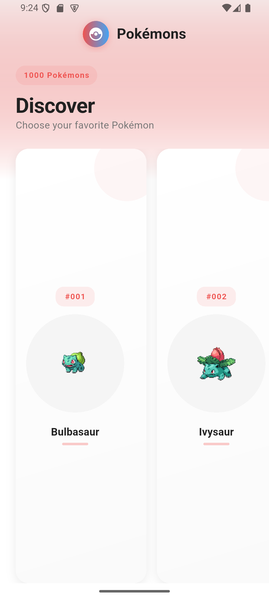
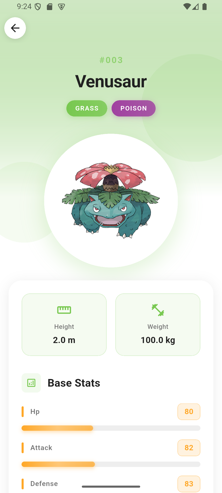

# **Pokedex**

Pokedex is built with Flutter (version 3.38.3) and uses the `PokeAPI` to display a list of 1,000 Pokemon. The number can be changed in the app_constants.dart file. If a user wants to view a specific Pokemon's description, they can tap on it, and the app will navigate to that Pokemon's detail page. The app follows Clean Architecture with a BLoC-driven presentation layer and includes a polished, animated UI for both the list and detail screens.


---
## **Technical Stack**

* **Framework:** Flutter 3.38.x (stable) with Dart 3.9, Material 3 widgets, responsive layouts, and strong null safety. Linting is configured through `analysis_options.yaml`.
* **State Management:** `flutter_bloc` handles all event/state logic and `equatable` ensures clean value comparisons. BLoCs expose clear APIs and are set up through dependency injection.
* **Networking & Models:** `dio` manages all HTTP calls with interceptors, timeouts, and cancellation. Data is fetched from `https://pokeapi.co/api/v2/pokemon`, and detail URLs come from the list results. Models use `freezed` and `json_serializable` to turn JSON into immutable domain objects.
* **Dependency Injection:** `get_it` connects repositories, data sources, BLoCs, connectivity checks, and utilities in `injection_container.dart` before the app starts.
* **Connectivity & Errors:** `connectivity_plus` reports online/offline status which BLoCs react to. Custom failures and mappers keep error messages consistent across the UI.
* **UI & Animations:** Theming uses custom colors, gradients, and type-based palettes. `flutter_animate` features motion effects, `Hero` animations link list and detail sprites and animated progress bars display stat values.
* **Assets & Caching:** `cached_network_image` caches Pokemon sprites with fade-ins and fallback icons. Static assets (logos, gradients, screenshots) are declared in `pubspec.yaml`.
* **Tooling:** Code formatting, linting, widget tests, and release builds (`flutter build apk`) ensure a clean and stable pipeline.

---

## **Project Structure**

* **App Setup:** `main.dart` initializes bindings, loads dependencies, and launches `App` from `app.dart`, which sets up routing, themes, and top-level BLoC providers.
* **Core Layer:** Contains constants, themes, colors, text styles, error handling, network utilities, and helper extensions for formatting names or building sprite URLs.
* **Feature Layer (`pokemon/`):**

  * **Data:** DTOs (Freezed), mappers, `dio`-based remote sources, and repository implementations that convert API responses into domain objects.
  * **Domain:** Entities (`Pokemon`, `PokemonDetail`, `PokemonStat`), repository contracts, and use cases like fetching lists or details.
  * **Presentation:** BLoCs for list and detail pages, plus widgets like Pokémon cards, stat items, loading states, and error views.

---

## **Flow & Navigation**

`PokemonListBloc` is used in the list page. Tapping a Pokémon pushes a detail page with a custom transition and creates a new `PokemonDetailBloc` for that entry. Loading, error, and success states are separated cleanly and data animates when rendered.

---

## **Requirement Compliance**

* The list screen fetches data from the required API and displays Pokemon names and sprites in a horizontal list with Hero animations.
* The detail screen fetches full information (stats, height, weight, images) from the provided URL and displays them with type-based gradients and animated stat bars.
* Both screens use BLoC for state management and present loading and retry options as expected.

---
## **Generative AI Usage**

- Used Sonnet-4.5 (Free Version) to understand the structure of the PokeAPI. It also helped me to get a refresher of the Clean Architecture layers and finding the easiest way to transform raw JSON into structured domain objects. I used it for animation-related guidance as well, including type-based color theming, hero animations, and stat slider animations. And of course, used it for debugging whenever I didn't understand an error message.

"explain the structure of the PokeAPI and its data"
   - "I have already worked with clean architecture, give a refresher about its layers"
   - "how to convert raw JSON from the PokeAPI into clean, strongly-typed domain models in flutter/dart"
   - "give me ideas on how to efficiently implement separate color themes for each pokemon type"
   - "how to animate pokemon stats using animated sliders or bars"
   - "give a simple example of using Hero animations in flutter"
   - "Replace deprecated withOpacity calls with flutter 3.38+ compatible apis"

## **How to Run**
1. Clone the repository:
   ```powershell
   git clone https://github.com/Rumman023/pokedex.git
   cd pokedex
   ```
2. Fetch dependencies:
   ```powershell
   flutter pub get
   ```
3. Run the app on a connected device or emulator:
   ```powershell
   flutter run
   ```
4. Build a release APK (optional):
   ```powershell
   flutter build apk --release
   ```

---

## **Screenshots**

**Splash Screen**


**List Screen**



**Detail Screen**



---


